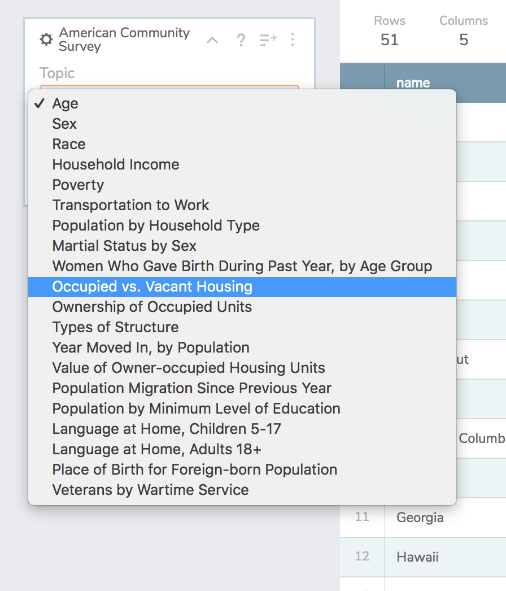
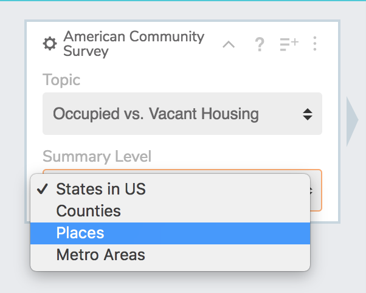
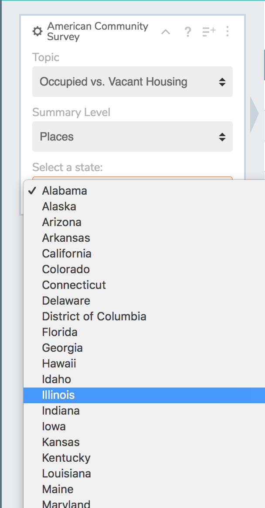
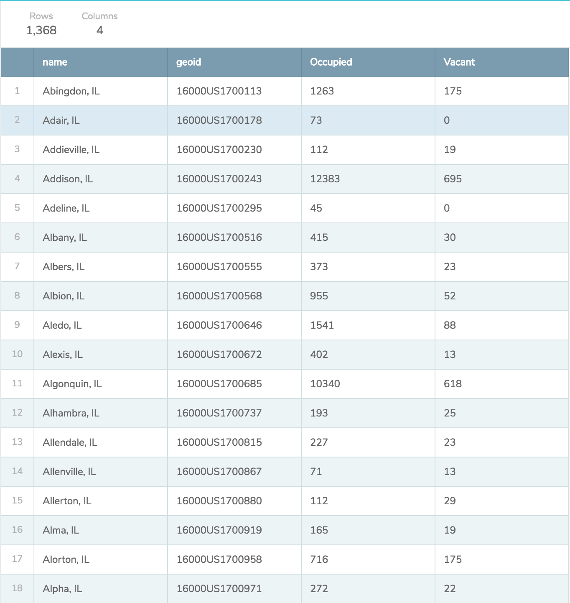

# American Community Survey Workbench Module

### Powered by [the Census Reporter API](https://github.com/censusreporter/census-api)

This is an external data module for [Workbench](https://github.com/CJWorkbench/cjworkbench) that helps users work with data from the [American Community Survey](https://www.census.gov/programs-surveys/acs/). The module is powered by the same API that powers the [Census Reporter](https://censusreporter.org/) project.

## Usage
 - Select the topic that you're interested in.


- Select the relevant summary level.


- Select the state from which you want the data (unless your summary level is States in US, in which case you can skip this step).


- Now you can take the data and continue your analysis!


## Contributing
Clone the repository, install packages.

Example:

```
git clone https://github.com/Joonpark13/censusreporter-workbench-module.git

pipenv install --three
```

You can find a primer to building external modules for Workbench [here](http://help.workbenchdata.com/build-a-custom-module/build-a-custom-module). Due to the current state of workbench module developer workflow, note that you'll be required to uncomment the top line of the python file

```python
# import pandas as pd
```

whenever you are locally running/testing the module. You should put the comment back in to avoid double imports when pushing an update.
